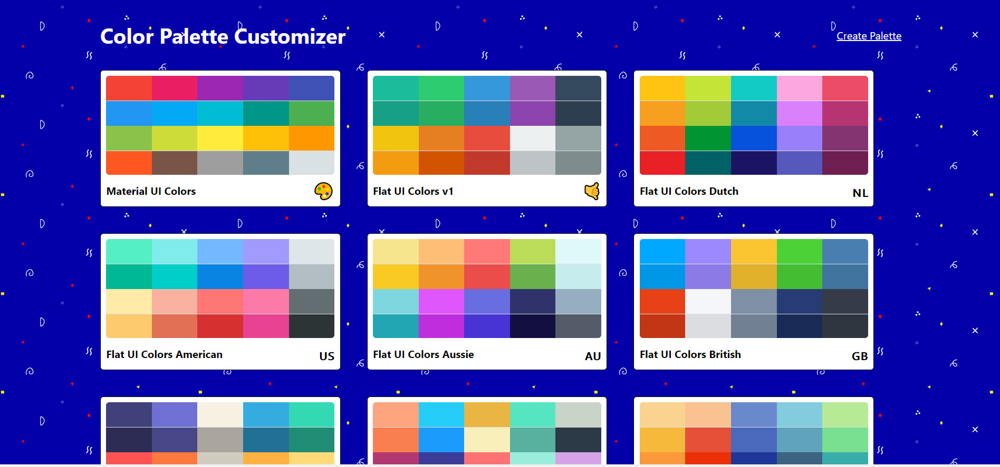
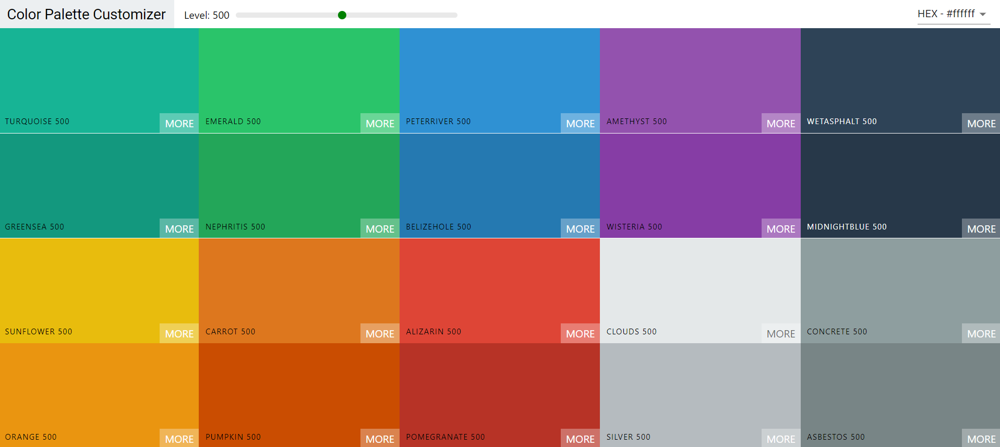
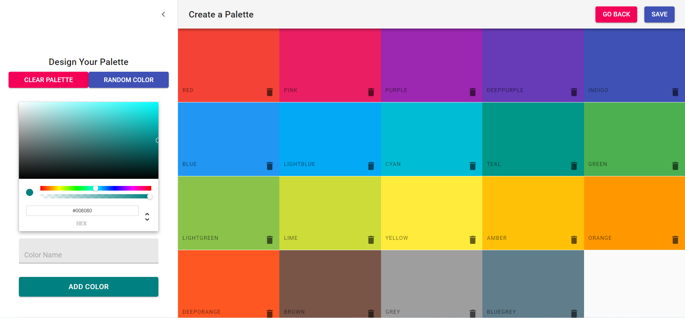

# Color Palette Organizer

## Description

A pedagogical color palette organizer/creator application built with React and Material UI.  Application allows user to copy color codes to the clipboard so that these colors can be easily used in other projects.  Features a variety of customizable options, including custom palette creation.

##### Homescreen

##### Single Palette View

##### Custom Palette Creator

Visit site [https://color-palette-customizer.herokuapp.com/](https://color-palette-customizer.herokuapp.com/).

## Table of Contents
  * [Installation](#installation)
  * [Usage](#usage)
  * [License](#license)
  * [Technologies](#technologies)
  * [Contributing](#contributing)
  * [Testing](#testing)
  * [Questions](#questions)
  
## Installation
Clone project to a directory on your local machine and cd into the colors app directory.  Run <$ npm install> to install dependencies.  See package.json for other available scripts.  

## Usage
Run <$ npm start> to launch application on a localhost development server.  Choose from an existing palette or create your own custom palette.  Select colors and customize their shades, then copy those colors' HEX or RGB/A codes to your clipboard.

## License 
This project is covered under the MIT license 

## Technologies
React, React Router, Material UI, React Transitions Group, Chroma, React Copy to Clipboard.

## Contributing
To see the guidelines adopted for contributing to this project, please view the [Contributor Covenant](https://www.contributor-covenant.org/version/2/0/code_of_conduct/code_of_conduct.txt)

## Testing
Tests coming soon

## Questions
Visit me at GitHub  
[christopherConcannon](https://github.com/christopherConcannon)
  
If you have any questions or would like to contact me, please email me at  
[cmcon@yahoo.com](mailto:cmcon@yahoo.com)
